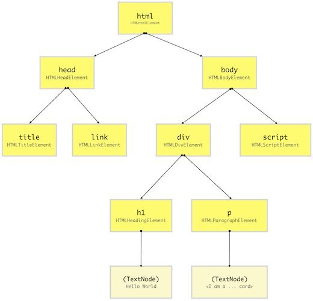
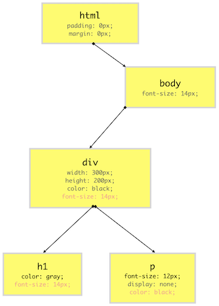
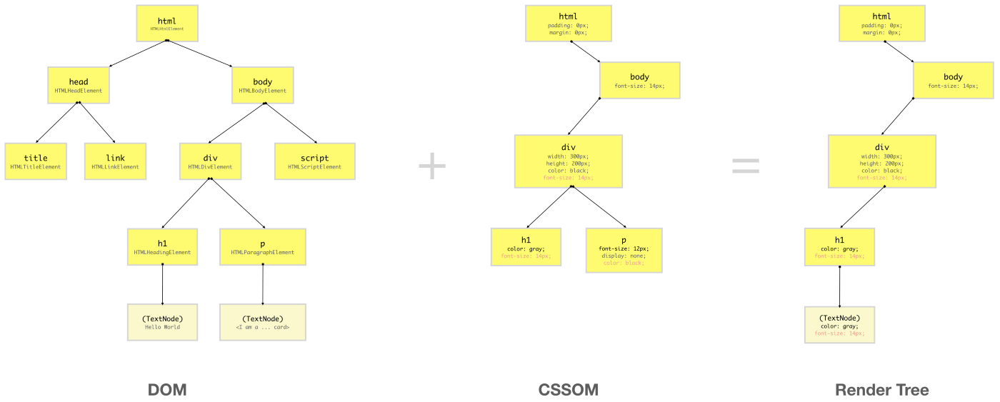

# 📝 todo-list 만들기
## 1. Mission 1
### 구현
- todo list
  - CRD
  - 브라우저 껐다 켜도 유지되어야 함
  - 디자인 자유
  - 추가 버튼: 추가 아이콘 svg 넣기
  - 삭제 버튼: 삭제 아이콘 png 넣기

### 조건
- 웹팩 사용 (브라우저 점유율 99%)
  - 웹팩 플러그인 사용
  - 웹팩 개발 서버 사용 (HMR)
- 바닐라 JS로만 (React X)
  - DOM API 적극 활용
- index.html 바디 노드 내부에는 엘리먼트 두개 이상 사용금지

---

### 1.1 webpack을 사용하는 이유는?

webpack은 모던 자바스크립트 애플리케이션을 위한 정적 모듈 번들러이다. 여기서 번들링이란 무엇일까? 번들링이란 기본적으로 여러 개로 흩어져 있는 파일들을 압축, 난독화 등을 하여 하나의 파일로 모아주는 역할을 한다. 번들링을 하지 않는다면 브라우저는 하나의 서비스를 불러올 때 그 서비스를 구성하는 모든 수많은 자바스크립트 파일과 img, svg 파일 등을 불러와야 할 것이다. 

HTTP는 TCP 연결 기반 위에서 동작하는 프로토콜로 신뢰성 확보를 위해 연결을 맺고 끊는 데 있어서 핸드 셰이크가 이루어진다. 거기에다 HTTP는 비연결성 프로토콜이기 때문에 한 번 연결로 한 번의 요청과 응답을 하고 응답이 끝나면 연결을 끊어 버린다. 연결 시에는 3-way 핸드 셰이크가 일어나고 연결을 끊을 때에는 4-way 핸드 셰이크가 일어나는데, 자바스크립트 파일 하나를 받아올 때에도 7번의 핸드 셰이크가 일어나는데, 만약 자바스크립트 파일을 100개를 받아와야한다면 총 700번의 핸드 셰이크가 발생한다. 이는 분명히 큰 로드이며 네트워크 환경이 좋지 않다면 사용자 경험에 엄청난 악영향을 미칠 것이다.

웹팩을 비롯한 번들러는 자바스크립트 파일들 뿐만 아니라, 애플리케이션에 필요한 모든 종류의 파일들을 모듈 단위로 나누어 번들로 만든다. 또한 uglify 뿐만 아니라 최신 문법의 자바스크립트를 모든 웹 브라우저에서 작동할 수 있도록 트랜스파일링하는 기능도 가지고 있다.

webpack을 포함해서 rollup, parcel 등의 번들러가 존재하지만 webpack을 가장 많이 사용하는 이유는 아무래도 사용자가 많기 때문에 형성된 넓은 환경과 그 plugins의 존재 때문이라고 볼 수 있다.

***참고***

[웹팩 document](https://webpack.kr/concepts/why-webpack/#root)
[HTTP 알아보기](https://www.whatap.io/ko/blog/38/)

### 1.2 Compile과 Transpile의 차이점

Compile: 어떠한 언어로 쓰여진 소스 코드를 컴퓨터가 이해할 수 있는 machine code로 바꾸는 과정을 일반적으로 Compile이라 한다.

Transpile: source-to-source compile이라고도 알려져 있다. 그래서 사실 기본적으로는 transpile은 compile의 하위 개념으로 볼 수 있고 소스 코드를 다른 언어로 바꾸거나 같은 언어의 다른 버전으로 바꾸는 역할을 수행한다. 일반적으로 사람이 이해할 수 있는 언어로 바꾸기 때문에 이를 실행하기 위해서는 compile 과정이 또 필요하다.

***참고***

[Compiler vs Transpiler](https://stackoverflow.com/questions/44931479/compiling-vs-transpiling)

### 1.3 loader와 plugin의 차이점은?

`loader`는 번들링 중이거나 그 전에 개별 파일에 대해 작동한다. webpack은 오직 자바스크립트와 JSON 파일만을 이해할 수 있는데, `loader`는 dependency graph에 추가된 다른 타입의 파일들도 유효한 모듈로 변환할 수 있도록 해준다.

`plugin`은 보통 번들링 마지막 프로세스에 bundle이나 chunk 레벨에 대해 동작한다. `plugin`은 번들 자체가 생성되는 방법을 수정할 수도 있다. `plugin`은 webpack의 기능을 확장시키거나 더 유연하게 하며 output에 영향을 준다. 

***참고***

[Webpack Loader vs Plugin](https://dev.to/kamesh_dev/webpack-loader-vs-plugin-1l20)

### 1.4 output을 쓰는 이유와 defer

#### defer
`<script>` 태그의 `defer` 속성은 페이지가 모드 로드된 후에 해당 외부 스크립트가 실행됨을 명시한다. `defer` 속성은 boolean 속성으로 명시하지 않으면 false, 명시하면 true 값을 갖는다. 

브라우저는 `defer` 속성이 있는 스크립트(defer 스크립트, 지연 스크립트)를 백그라운드에서 다운로드한다. 따라서 지연 스크립트를 다운로드하는 도중에도 HTML 파싱이 멈추지 않는다. 그리고 `defer` 스크립트 실행은 페이지 구성이 끝날 때까지 지연된다.

지연 스크립트는 일반 스크립트와 마찬가지로 HTML에 추가된 순으로 실행된다. 따라서 길이가 긴 스크립트가 앞에, 길이가 짧은 스크립트가 뒤에 있어도 짧은 스크립트는 긴 스크립트가 실행될 때까지 기다린다.

> 브라우저는 성능을 위해 먼저 페이지에 어떤 스크립트들이 있는지 쭉 살펴본 후에야 스크립트를 병렬적으로 다운로드한다. 뒤에 있는 크기가 작은 스크립트들이 앞의 크기가 큰 스크립트들보다 더 먼저 다운될 수 있지만 실행은 스크립트를 문서에 추가한 순서대로 실행된다.
---
### 1.5 `querySelector`와 `getElementById`의 차이점?
```javascript
import './index.css'

const word = 'hello world';

document.querySelector('#root').innerHTML = word;
```
처음에 예시 파일을 위와 같이 작성했었는데, querySelector와 getElementById의 차이점도 모른 채 사용했다는 것을 알게되었다.
#### querySelector

`Document.querySelector()`는 제공한 선택자 또는 선택자 뭉치와 일치하는 문서 내 첫 번째 Element를 반환한다. 일치하는 요소가 없으면 null을 반환한다.

`document.querySelector(selectors)`구문으로 실행할 수 있는데, 이 때 selectors는 하나 이상의 선택자를 포함한 DOMString이다. 직접 확인해본 결과 selectors는 `querySelector('#first', '#second')` 같이 하나 이상의 선택자를 넣어줄 수 있었다. 이 여러개의 선택자 중 첫번째로 일치하는 요소를 선택한다.

`Document.querySelectorAll()`이라는 메소드도 있다. 해당 메소드는 지정된 셀렉터 그룹에 일치하는 다큐먼트의 엘리먼트 리스트를 나타내는 정적 NodeList를 반환한다. 이때 NodeList는 index 번호로 접근이 가능하다.

#### getElementById
`Document.getElementById()` 메서드는 주어진 문자열과 일치하는 id 속성을 가진 요소를 찾고, 이를 나타내는 Element 객체를 반환한다. 이때 반환된 객체에는 name, id, index 번호로 접근이 가능하다. MDN 문서에서는 ID가 없는 요소에 접근하려면 `Document.querySelector()`를 사용하라고 명시되어있다. 그렇다면 굳이 모든 선택자를 사용할 수 있는 `Document.querySelector()`를 두고 왜 `Document.getElementById()` 메서드가 있을까? 

`Document.querySelector()`나 `Document.querySelectorAll()`과는 달리 `getElementById()`는 전역 document 객체의 메서드로만 사용할 수 있고, DOM의 다른 객체는 메서드로 가지고 있지 않다. ID 값은 문서 전체에서 유일해야 하며 "국지적"인 버전을 쓸 이유가 없기 때문이다.

다시 내 말로 풀어쓰면 id는 모든 노드에 걸쳐서 고유한 값이기 때문에 각 엘리먼트마다 `getElementyById()` 메서드를 가질 필요없이 document 전역 객체에서만 가지고 있어도된다. 이 때문에 아래와 같은 코드는 오류가 발생하는 것이다.

```html
<!doctype html>
<html>
<head>
    <meta charset="UTF-8">
    <title>Document</title>
</head>
<body>
    <div id="parent-id">
        <p>hello word1</p>
        <p id="test1">hello word2</p>
        <p>hello word3</p>
        <p>hello word4</p>
    </div>
    <script>
        var parentDOM = document.getElementById('parent-id');
        var test1=parentDOM.getElementById('test1');
        //throw error
        //Uncaught TypeError: parentDOM.getElementById is not a function
    </script>
</body>
</html>
```

---
## 2. Mission 2
0. 모든 결정에 "왜?" 라는 고민을 하고, 고민의 과정을 기록
1. Resource assets, Inlining assets 적용
2. 파일 두개 이상으로 분리 
3. let 쓰지 않기
4. 성능 개선 (프로파일링 직접 하기) <- 1만개의 아이템을 추가했다가 삭제하는 스크립트 짜기 (자동화)
5. 가독성 개선
6. 로컬스토리지의 단점 조사 (그래도 로컬 스토리지는 사용하기)
7. 이벤트 위임 적용

---
### ⭐️ 파일 두개 이상으로 분리
리액트를 사용한 프로젝트를 주로 했어서, 컴포넌트 단위 개발에 익숙하다. Vanila JS에서는 모듈을 어떻게 분리하였는지, 또 html 파일은 어떻게 분리하여 사용할 수 있는지 알아볼 필요가 있었다.

HTML, CSS, JavaScript 세 파일로 이루어지는 프로젝트의 폴더 구조는 어떤지 찾아보았다. 그 결과 src 폴더 아래 css, img, js 폴더를 두는 구조로 결정하였다.

### ⭐️ body안에 엘리먼트 최대 두개만
body안에 엘리먼트를 최대 두개만 둬야한다. 일단 전체를 감싸는 div태그 하나와 form태그 정도를 두는걸 생각했었는데 그럼 그 안에 들어가는 엘리먼트들은 다 `createElement()` 메서드로 만들어야할까? 그렇다면 `createElement()` 메서드가 너무 많이 사용될거 같아 다른 방법을 알아보고자 했다.

1. 첫번째 방법
```javascript
const rootBody = document.getElementById("root");
rootBody.innerHTML = "<div><h1>TODO LIST</h1><h2>todo list</h2></div>"
```
JSX 문법과 비슷하게 `innerHTML` 에 html 태그들로 이루어진 문자열을 할당한다. 

2. 두번째 방법
```javascript
const rootBody = document.getElementById("root");
rootBody.insertAdjacentHTML('afterbegin', '<div><h1>TODO LIST</h1><h2>todo list</h2></div>')
```
`insertAdjacentHTML` 메서드는 HTML 또는 XML 같은 특정 텍스트를 파싱하고, 특정 위치에 DOM tree 안에 원하는 node들을 추가한다. 이미 사용중인 element는 다시 파싱하지 않는다. 그러므로 element 안에 존재하는 element들을 건드리지 않는다. (`innerHTML`은 덮어쓴다) `innerHTML`보다 작업이 덜 드므로 빠르다. 하지만 여전히 XSS 공격으로부터 취약하다.

`innerHTML`메서드는 파싱 과정이 한번 더 있어 `insertAdjacentHTML`보다 성능이 좋지 않고 HTML 문자열을 그대로 추가하는 것이기 때문에 XSS 공격의 위험으로 보안상의 문제도 있다. 대체재로 `textContent`와 `innerText`가 있고 `textContent`를 사용하는 것이 가장 좋다.

***참고***
>[MDN](https://developer.mozilla.org/ko/docs/Web/API/Element/insertAdjacentHTML)
[티스토리](https://chanto11.tistory.com/51)

### ⭐️ XSS (Cross Site Scripting)

크로스 사이트 스크립팅(XSS)은 공격자가 상대방의 브라우저에 스크립트가 실행되도록 해 사용자의 세션을 가로채거나, 웹사이트를 변조하거나, 악의적 컨텐츠를 삽입하거나, 피싱 공격을 진행하는 것을 말한다. 웹사이트 사이를 넘어서 공격한다는 의미에서 크로스 사이트 스크립팅이라는 용어가 생겼다.

### ⭐️ Resource assets, Inlining assets 적용
webpack5부터 기존의 로더들을 대체하기 위해 4개의 새로운 모듈 유형이 추가되었다. 애셋 모듈은 로더를 추가로 구성하지 않아도 애셋 파일(폰트, 아이콘 등)을 사용할 수 있도록 해주는 모듈이다.

네개의 새로운 모듈 중 별도의 파일을 내보내고 URL을 추출하는 `asset/resource` 모듈과 애셋의 data URI를 내보내는 `asset/inline` 모듈을 사용하고자 한다.

#### Resource assets
```javascript
const path = require('path');

module.exports = {
  entry: './src/index.js',
  module: {
    rules: [
      {
        test: /\.png/,
        type: 'asset/resource'
      }
    ]
  },
};
```
```javascript
import mainImage from './images/main.png';

img.src = mainImage; // '/dist/151cfcfa1bd74779aadb.png'
```
모든 png 파일을 출력 디렉터리로 내보내고 해당 경로를 번들에 삽입한다.

#### Inlining assets
```javascript
const path = require('path');

module.exports = {
  entry: './src/index.js',
  module: {
    rules: [
      {
        test: /\.svg/,
        type: 'asset/inline'
      },
    ]
  }
};
```
```javascript
import addIcon from './assets/add.svg';

addImg.style.background = `url(${addIcon})`;
```

### ⭐️ 로컬스토리지의 단점 조사 (그래도 로컬 스토리지는 사용하기)

웹 스토리지 객체(web storage object)인 localStorage와 sessionStorage는 브라우저 내에 키-값 쌍을 저장할 수 있게 해준다.

이 둘을 사용하면 페이지를 새로 고침하고(sessionStorage의 경우) 심지어 브라우저를 다시 실행해도(localStorage의 경우) 데이터가 사라지지 않고 남아있다. 그런데 "쿠키를 사용하면 브라우저에 데이터를 저장할수 있는데, 왜 또 다른 객체를 사용해 데이터를 저장하는걸까요?"라는 의문이 들 수 있다. 쿠키 이외에도 다른 방식을 사용하는 이유는 다음과 같다.

- 쿠키와 다르게 웹 스토리지 객체는 네트워크 요청 시 서버로 전송되지 않는다. 이런 특징 때문에 쿠키보다 더 많은 자료를 보관할 수 있다.
- 서버가 HTTP 헤더를 통해 스토리지 객체를 조작할 수 없다. 웹 스토리지 객체 조작은 모두 자바스크립트 내에서 수행된다.
- 웹 스토리지 객체는 도메이, 프로토콜, 포트로 정의되는 오리진에 묶여있다. 따라서 프로토콜과 서브 도메인이 다르면 데이터에 접근할 수 없다.

#### 로컬스토리지
- 오리진이 같은 경우 데이터는 모든 탭과 창에서 공유된다.
- 브라우저나 OS가 재시작하더라도 데이터가 파기되지 않는다.

로컬스토리지의 키와 값은 반드시 문자열이어야 한다. 숫자나 객체 등 다른 자료형을 사용하게 되면 문자열로 자동 변환된다.
```javascript
localStorage.user = {name: "John"};
alert(localStorage.user); // [object Object]
```
JSON을 사용하면 객체를 쓸 수 있다.
```javascript
localStorage.user = JSON.stringify({name: "John"});

// 잠시 후
let user = JSON.parse( localStorage.user );
alert( user.name ); // John
```

#### 세션스토리지
로컬스토리지와 제공하는 프로퍼티와 메서드는 같지만, 훨씬 제한적이다.

- 세션스토리지는 현재 떠 있는 탭 내에서만 유지된다.
  - 같은 페이지라도 다른 탭에 있으면 다른 곳에 저장되기 때문이다.
  - 그런데 하나의 탭에 여러 개의 iframe이 있는 경우엔 동일한 오리진에서 왔다가 취급되기 때문에 세션스토리지가 공유된다.
- 페이지를 새로 고침할 때 데이터가 사라지지 않는다. 하지만 탭을 닫고 새로 열 때는 사라진다.
> iframe -> inline frame의 약자로 웹 페이지 안에 또 다른 웹 페이지를 삽입

#### 쿠키
위에도 쿠키와의 차이점을 적었지만 쿠키에 대해 아직 잘 모르는 것 같아서 조사를 해봤다.

쿠키는 긴 시간동안 앱 또는 웹사이트를 방문하는 유저들에 대한 정보를 저장하는 주된 방법이었다고 한다. 쇼핑 카트 항목들 또는 유저에 의해 변경된 옵션같은 상태를 기록하는데 사용되었다. 그리고 유저가 검색한 것을 기억하거나 페이지 간 이동했을 때 로그인 상태를 유지하는데에 사용되었다.

쿠키는 웹사이트에 의해 유저의 컴퓨터에 놓여지는 작은 텍스트 파일들로 최대 4KB의 용량을 가진 매우 작은 양의 데이터이다. 쿠키는 사이트에서 방문한 페이지를 저장하거나 유저의 로그인 정보를 저장하는 등 다양한 방법으로 사용된다. 그리고 문자열만 저장할 수 있다는 제한이 있다.

쿠키는 두가지 유형이 있는데 `persistent cookies`와 `session cookies`이다.

`session cookies`는 만료일을 포함하지 않지만 대신 브라우저나 탭이 열려있는 동안에만 저장되며 브라우저가 닫히면 쿠키는 영구적으로 삭제된다. (은행권에서 사용하기 좋다)

`persistent cookies`는 만료일을 가진다. 이 쿠키는 만료일까지 유저의 디스크에 저장되고 만료일이 지나면 삭제된다. 유저들이 방문할 때마다 유저 경험을 커스텀하기 위해 특정 웹사이트에서 행동을 기록하는 등 여러 활동들에 사용될 수 있다.

쿠키와 로컬스토리지의 가장 중요한 차이점 중 하나는 쿠키와는 달리 모든 HTTP 요청에서 로컬스토리지는 데이터를 주고받을 필요가 없다는 것이다. HTTP 요청에서 데이터를 주고받지 않고 로컬스토리지를 이용하면 클라이언트와 서버간의 전체 트랙픽과 낭비되는 대역폭의 양을 줄일 수 있다. 데이터가 유저의 로컬 디스크에 저장되어 있으면 인터넷이 끊어져도 데이터가 삭제되거나 지워지지 않기 때문이다. 이 때문에 인터넷 연결이 잘 유지되지 않는 지역에서 사용하는 애플리케이션의 경우 유용하다. 또한 로컬스토리지는 최대 5MB의 정보를 저장할 수 있어 쿠키의 용량보다 훨씬 크다.

로컬스토리지의 만료 조건은 `persistent cookies`처럼 동작하는데 자바스크립트 코드를 통해 삭제하지 않으면 데이터는 자도응로 삭제되지 않는다. 오랜 시간동안 저장해야하는 큰 데이터에 유용하다. 또한 로컬스토리지를 사용하면 문자열 뿐만 아니라 자바스크립트의 primitives와 object도 저장할 수 있다.

지금까지 로컬스토리지의 장점만 나열하였는데 그렇다면 단점도 있을까? 우선 HTML5부터 지원되는 기능이기 때문에 HTML4만 지원되는 구형 브라우저에서는 지원이 되지 않는다. (물론 이제 그럴일은 없을 것 같다)

또한 로컬스토리지는 저장되는 단계에서 입력된 데이터를 평문 그대로 로컬 디스크에 저장하며, 파일의 형태로 디스크에 저장되기 때문에, Cross Site Scripting(XSS) 공격부터 물리적인 공격까지 다양한 악의적인 공격을 통해 파일의 내용을 열람하거나, 파일 자체를 네트워크를 통해 외부로 전송하는 것이 가능하다. 획득한 로컬스토리지 파일은 쉽게 수정이 가능하고, 값을 획득하였을 경우, 획득한 값을 이용하여 동일한 로컬스토리지를 생성하는 것 또한 가능하다. 또한 획득한 로컬스토리지 파일을 생성한 도메인이 아닌 다른 도메인에서 재사용이 가능하다. 따라서 민감한 데이터를 로컬스토리지에 저장하는 것은 추천되지 않는다.

***참고***
[모던자바스크립트 튜토리얼](https://ko.javascript.info/localstorage)
[쿠키 vs 로컬스토리지](https://erwinousy.medium.com/%EC%BF%A0%ED%82%A4-vs-%EB%A1%9C%EC%BB%AC%EC%8A%A4%ED%86%A0%EB%A6%AC%EC%A7%80-%EC%B0%A8%EC%9D%B4%EC%A0%90%EC%9D%80-%EB%AC%B4%EC%97%87%EC%9D%BC%EA%B9%8C-28b8db2ca7b2)

### ⭐️ 이벤트 위임 적용
이벤트 위임이란 무엇일까? 이벤트 위임을 한 문장으로 요약하면 '하위 요소에 각각 이벤트를 붙이지 않고 상위 요소에서 하위 요소의 이벤트들을 제어하는 방식'이다.
```html
<h1>오늘의 할 일</h1>
<ul class="itemList">
  <li>
    <input type="checkbox" id="item1">
    <label for="item1">이벤트 버블링 학습</label>
  </li>
  <li>
    <input type="checkbox" id="item2">
    <label for="item2">이벤트 캡쳐 학습</label>
  </li>
</ul>
```
```javascript
const itemList = document.querySelector('.itemList');
itemList.addEventListener('click', function(event) {
	alert('clicked');
});
```
화면의 모든 인풋 박스에 일일이 이벤트 리스너를 추가하는 대신 인풋 박스의 상위 요소인 ul 태그, .itemList에 이벤트 리스너를 달아놓고 하위에서 발생한 클릭 이벤트를 감지한다. 

***참고***
[이벤트 버블링, 이벤트 캡처 그리고 이벤트 위임까지](https://joshua1988.github.io/web-development/javascript/event-propagation-delegation/#%EC%9D%B4%EB%B2%A4%ED%8A%B8-%EC%BA%A1%EC%B3%90---event-capture)

## 3. Mission 3
- [x] svg 태그로 인라인 써보기
- [ ] png 인라인으로, 외부파일 두가지 장단점 비교, 어떤 상황에서 적용해야할지
- [ ] paintToDo reflow repaint 과정 1회로 줄여보기 (줄이기 전에 1만개의 일을 추가해보고 줄인 후와 성능 비교해보기)
- [ ] 로컬스토리지

### ⭐️ 이벤트 전달 과정

### ⭐️ 브라우저 렌더링 과정
브라우저 렌더링 과정을 살펴보기 전에 먼저 살펴봐야할 핵심 키워드들을 정리해보자.
#### 1. DOM
브라우저가 HTML 코드를 읽을때, HTML element를 만나면 `Node`라는 JavaScript 객체를 생성한다. HTML elements가 자바스크립트 객체로 변환된다. 

예를 들어, div element는 `HTMLDivElement`메서드로부터 Node 객체로 변환된다. 어쨌든 이렇게 브라우저가 HTML document로부터 노드 객체들을 생성한 후에, 이 노드 객체들로 트리 구조를 생성한다. HTML elements들이 서로 복잡하게 위치해있기 때문에, 브라우저는 그것을 HTML elements가 아닌 노드 객체들로 해당 구조를 복제하여 트리를 생성한다.

> `DOM 노드`가 반드시 HTML element여야하는 것은 아니다. 브라우저가 DOM 트리를 만들 때 comments, attributes, text 같은 것들을 트리의 분리된 노드에 저장한다. 



자바스크립트는 DOM이 뭔지 알지 못한다. DOM은 브라우저에 의해 제공되는 `Web API`이기 때문이다.

#### 2. CSSOM
HTML elements에 스타일을 적용하는 방법은 외부 CSS 파일을 이용하거나, 인라인 style attribute를 이용하거나 자바스크립트를 이용하는 방법이 있을 것이다. 하지만 결국에는 브라우저가 CSS styles를 DOM elements에 적용해야한다. DOM 트리를 만들고 나서 브라우저는 모든 소스(external, embedded, inline, user-agent, etc.)로부터 CSS를 읽고 CSSOM을 생성한다. CSSOM은 마치 DOM과 같이 트리 구조로 되어있다.

CSSOM의 각 노드는 DOM elements에 적용될 CSS style 정보를 가지고 있다. 하지만 `<meta>`, `<script>`, `<title>`과 같이 스크린에 표시되지 않을 DOM elements에 대해서는 정보를 가지고 있지 않다.

빨간 글씨로 표기되어있는 CSS property는 cascaded down된 것이다.

#### 3. Render Tree
`Render Tree`는 `DOM` 트리와 `CSSOM` 트리를 조합해서 만들어진다. 브라우저는 visible element의 layout을 계산 후 스크린에 그려야하는데 이때 `Render Tree`를 이용한다.

`Render Tree`는 `pixel matrix`의 어떠한 부분도 차지하지 않는, 그러니까 화면에 보이지 않을 노드들을 포함하지 않는다. 예를 들어, `display: none;` elements는 `0px 0px`의 dimensions를 갖기 때문에 `Render Tree`에 포함되지 않는다.


#### 브라우저 렌더링 동작 과정
렌더링의 기본적인 동작 과정은 다음과 같다.
1. HTML 파일과 CSS 파일을 파싱해서 각각 Tree를 만든다. (Parsing)
2. 두 Tree를 결합하여 Rendering Tree를 만든다. (Style)
3. Rendering Tree에서 각 노드의 위치와 크기를 계산한다. (Layout)
4. 계산된 값을 이용해 각 노드를 화면상의 실제 픽셀로 변환하고, 레이어를 만든다. (Paint)
5. 레이어를 합성하여 실제 화면에 나타낸다. (Composite)

***Parsing***

브라우저가 페이지를 렌더링하려면 가장 먼저 받아온 HTML 파일을 해석해야한다. Parsing 단계는 HTML 파일을 해석하여 DOM(Document Object Model) Tree를 구성하는 단계이다.

파싱 중 HTML에 CSS가 포함되어 있다면 CSSOM(CSS Object Model) Tree 구성 작업도 함께 진행한다.

***Style***

Style 단계에서는 Parsing 단계에서 생성된 DOM Tree와 CSSOM Tree를 매칭시켜서 Render Tree를 구성한다. Render Tree는 실제로 화면에 그려질 Tree이다.

예를 들면 Render Tree를 구성할때 visibility: hidden은 요소가 공간을 차지하고, 보이지만 않기 때문에 Render Tree에 포함이 되지만, display: none 의 경우 Render Tree에서 제외된다.

***Layout***
Layout 단계에서는 Render Tree를 화면에 어떻게 배치해야 할 것인지 노드의 정확한 위치와 크기를 계산한다.

루트부터 노드를 순회하면서 노드의 정확한 크기와 위치를 계산하고 Render Tree에 반영한다. 만약 크기 값을 %로 지정하였다면, Layout 단계에서 % 값을 계산해서 픽셀 단위로 변환한다.

***Paint***

Paint 단계에서는 Layout 단계에서 계산된 값을 이용해 Render Tree의 각 노드를 화면상의 실제 픽셀로 변환한다. 이때 픽셀로 변환된 결과는 하나의 레이어가 아니라 여러 개의 레이어로 관리된다.

당연한 말이지만 스타일이 복잡할수록 Paint 시간도 늘어난다. 예를 들어, 단색 배경의 경우 시간과 작업이 적게 필요하지만, 그림자 효과는 시간과 작업이 더 많이 필요하다.

***Composite***

Composite 단계에서는 Paint 단계에서 생성된 레이어를 합성하여 실제 화면에 나타낸다. 우리는 화면에서 웹 페이지를 볼 수 있다.

***참고***

[How the browser renders a web page?](https://medium.com/jspoint/how-the-browser-renders-a-web-page-dom-cssom-and-rendering-df10531c9969)

[브라우저 렌더링 과정 이해하기](https://tecoble.techcourse.co.kr/post/2021-10-24-browser-rendering/)

### ⭐️ repaint와 reflow


### ⭐️ png 인라인으로, 외부파일 두가지 장단점 비교, 어떤 상황에서 적용해야할지

#### Data URI
웹팩 설정에서 `asset/inline` 모듈을 사용할 경우 애셋의 data URI를 내보낸다. 이때 Data URI가 무엇일까?

Data URIs, 즉 `data:` 스킴이 접두어로 붙은 URL은 컨텐츠 작성자가 작은 파일을 문서 내에 ***인라인으로 임베드***할 수 있도록 해준다.

Data URIs는 네 가지 파트로 구성된다. 접두사(data:), 데이터의 타입을 가리키는 MIME 타입, 텍스트가 아닌 경우 사용될 부가적인 `base64` 토큰 그리고 데이터 자체:

`data:[<mediatype>][;base64],<data>`

`mediatype` 이란, MIME 타입을 말한다(JPEG 이미지의 경우 'image/jpeg'). 만약 생략된다면, 기본 값으로 `text/plain;charset=US-ASCII`이 사용된다.

데이터가 텍스트인 경우, 단순히 텍스트를 임베드할 수 있다. 그게 아니라면, base64로 인코딩된 이진 데이터를 임베드하기 위해 `base64`를 지정할 수 있다.

#### png파일 인라인으로 적용하기
```javascript
export const paintToDo = (newToDoObj) => {
  const toDoList = document.getElementById('todo-list');
  const deleteImg = deleteIcon;
  const toDo = `
    <li id=${newToDoObj.id}>
      <span>${newToDoObj.text}</span>
      <button>
        
      </button>
    </li>
  `
  toDoList.insertAdjacentHTML('beforeend',toDo);
}
```
위에 적어놨다시피 `asset/inline` 모듈을 사용할 경우 `data URI` 를 반환해준다. 이를 인라인에 적용하기 위해서 위와 같이 코드를 작성하였다.


네트워크 탭을 살펴보니 memory cache돼있는 것을 볼 수 있다. 

***참고***

[MDN Data URIs](https://developer.mozilla.org/ko/docs/Web/HTTP/Basics_of_HTTP/Data_URLs)

#### png파일 외부파일로 적용하기


웹팩 문서에 따르면 웹팩은 기본 조건에 따라서 `resource`와 `inline`중에서 자동으로 선택한다고 한다. 크기가 8kb 미만인 파일은 `inline`모듈로 처리되고 그렇지 않으면 `resource`모듈로 처리된다.

따라서 크기가 작은 파일은 inline 모듈, 비교적 큰 파일은 resource 모듈로 처리하는 것이 효과적이라고 볼 수 있다.
